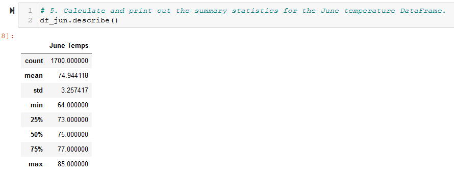
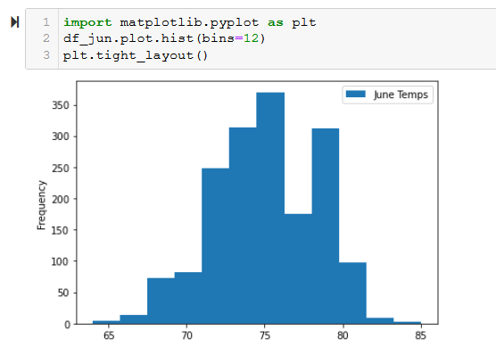
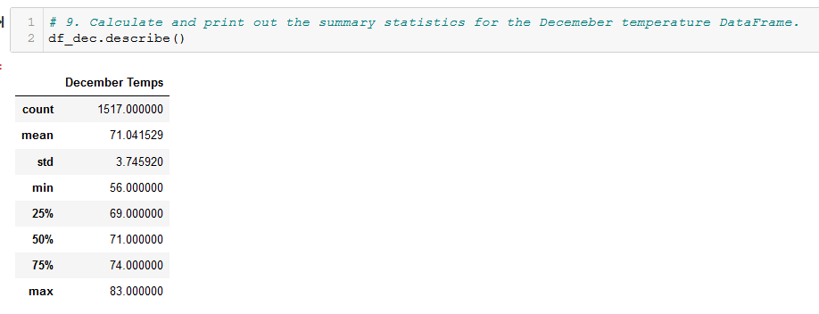
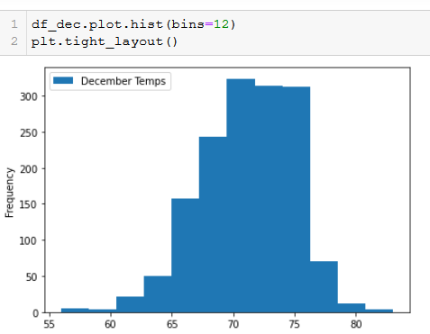
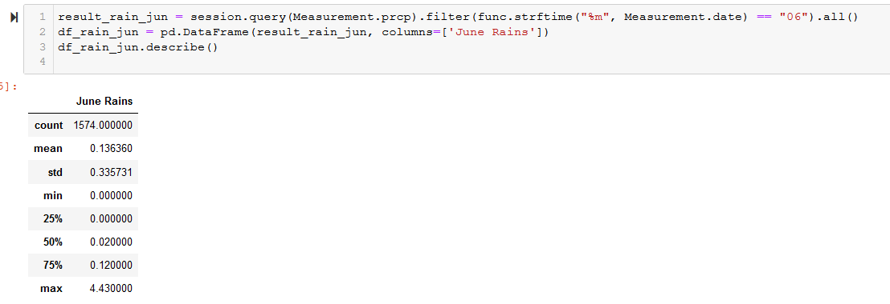
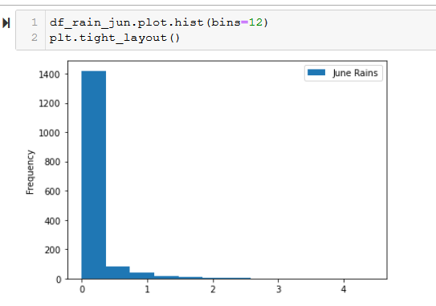
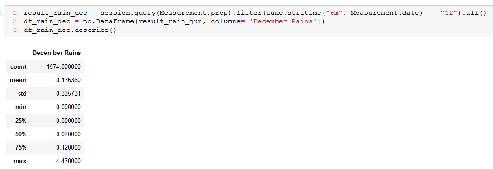
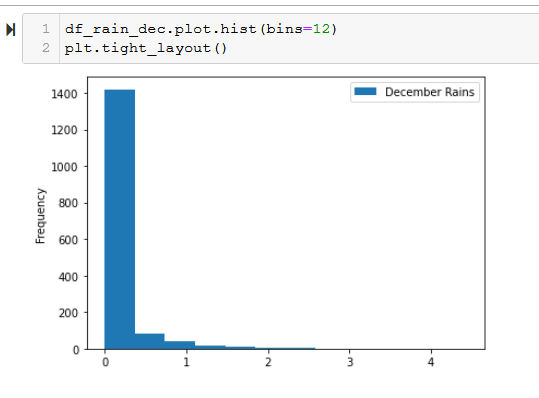

# surfs_up

## Project Overview

Our task was to provide more information about temperature trends for the months of June and December in Oahu, in order to determine if a surf and ice cream shop business is sustainable year-round.

## Results

### Differences between June and December temperature data

1. Mean June temperatures (Figure 1) of [min=64, mean=74.94, max=85] are slightly higher than Mean December temperatures (Figure 3) of (min=56, mean=71.04, max=83)
2. Both June temperatures (Figure 1) [mean=74.94 is almost equal to median=74] and December temperatures (Figure 3) [mean=71.04 is almost equal to median=71.00] have a fairly normal distribution
3. Mean June rains (Figure 5) of [min=0, mean=0.14, max=4.43] are nearly identical to December rains (Figure 8) [min=0.00, mean=0.14, max=4.43]

### Deliverable 1

Using Python, Pandas functions and methods, and SQLAlchemy, we filtered the date column of the Measurements table in the hawaii.sqlite database to retrieve all the temperatures for the month of June. Then we converted those temperatures to a list, created a DataFrame from the list, and generated the summary statistics.

###### 1. The code to collect June temperature data

The complete code with screenshots are shown below.

```
import numpy as np
import sqlalchemy
from sqlalchemy.ext.automap import automap_base
from sqlalchemy.orm import Session
from sqlalchemy import create_engine, func, extract
import pandas as pd
import matplotlib.pyplot as plt

engine = create_engine("sqlite:///hawaii.sqlite")

Base = automap_base()
Base.prepare(engine, reflect=True)

Measurement = Base.classes.measurement
Station = Base.classes.station

session = Session(engine)

# NOTE1: Code that's specific to June data
result_jun = session.query(Measurement.tobs).\
  filter(func.strftime("%m", Measurement.date) == "06").all()
df_jun = pd.DataFrame(result_jun, columns=['June Temps'])
df_jun.describe()

# NOTE2: Code that's specific to June plot
df_jun.plot.hist(bins=12)
plt.tight_layout()
```

###### 2. June temperature summary DataFrame

**Figure 1**



###### 3. June temperature barplot

**Figure 2**



### Deliverable 2

This deliverable is the same as Deliverable 1 above, except for December instead of June. The code is shown below. The only differences from above is that we replaced the code labeled 'NOTE3' and 'NOTE4' below instead of that labeled 'NOTE1' and 'NOTE2' above.

###### 1. Changes to code above to for June -> December

```
# NOTE3: Code that's specific to December data
result_dec = session.query(Measurement.tobs).\
  filter(func.strftime("%m", Measurement.date) == "12").all()
df_jdec = pd.DataFrame(result_dec, columns=['December Temps'])
df_dec.describe()

# NOTE4: Code that's specific to December plot
df_dec.plot.hist(bins=12)
plt.tight_layout()
```

###### 2. December temperature summary DataFrame

**Figure 3**



###### 3. December temperature barplot

**Figure 4**



## Results

There was no big surprise regarding weather on Oahu. It is nearly perfect year-round. Temperature and precipitation measures differ very little between June and December. The rain data was collected with the two additional queries shown below.

#### Additional Query #1 - June Rains

```
result_rain_jun = session.query(Measurement.prcp).filter(func.strftime("%m", Measurement.date) == "06").all()
df_rain_jun = pd.DataFrame(result_rain_jun, columns=['June Rains'])
df_rain_jun.describe()

df_rain_jun.plot.hist(bins=12)
plt.tight_layout()
```

###### 1. June rains summary DataFrame

**Figure 5**



###### 2. June rains barplot

**Figure 6**




#### Additional Query #2 - December Rains

```
result_rain_dec = session.query(Measurement.prcp).filter(func.strftime("%m", Measurement.date) == "12").all()
df_rain_dec = pd.DataFrame(result_rain_jun, columns=['December Rains'])
df_rain_dec.describe()

df_rain_dec.plot.hist(bins=12)
plt.tight_layout()
```

###### 1. December rains summary DataFrame

**Figure 7**



###### 2. December rains barplot

**Figure 8**


